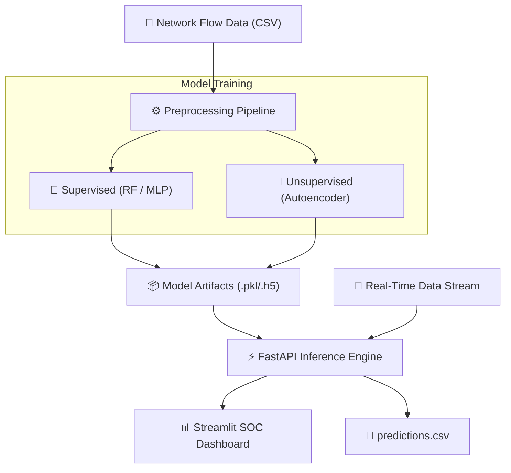

<div align="center">

# 🛡️ AI-Powered Intrusion Detection System (IDS)

**🤖 Classical ML & Deep Learning • 🔍 Zero-Day Anomaly Detection • ⚡ Real-Time Inference • 📊 Streamlit Dashboard**

[](https://www.python.org/)
[](https://scikit-learn.org/)
[](https://en.wikipedia.org/wiki/Autoencoder)
[](https://fastapi.tiangolo.com/)
[](https://streamlit.io/)

An end-to-end Machine Learning pipeline for detecting network intrusions and malicious traffic flows. This project implements both **Supervised Learning** (Random Forest, MLP) for known threat classification and **Unsupervised Deep Learning** (Autoencoders) for zero-day anomaly detection. 

<br>

</div>

## 🚀 Overview

Modern networks require more than signature-based defenses. This project demonstrates a production-ready AI pipeline that ingests tabular network flow data (e.g., NSL-KDD, CIC-IDS2017), handles preprocessing and class imbalance, trains robust models, and deploys them for near real-time inference.

### ✨ Key Features
*   **🧠 Dual Detection Engines:** Run in Supervised Mode (high precision on known attacks) or Unsupervised Autoencoder Mode (anomaly detection for zero-days).
*   **⚙️ Rock-Solid Pipeline:** Strict train/test isolation. Preprocessing logic (scalers, encoders) is fitted only on training data and serialized as deployment artifacts.
*   **⚖️ Imbalance Handling:** Built-in SMOTE integration to handle heavily skewed network traffic datasets.
*   **📈 Comprehensive Evaluation:** Automated generation of Confusion Matrices, PR/ROC curves, and classification reports prioritizing Recall/F1.
*   **⚡ Real-Time Simulation:** Ingests "streaming" CSV data to simulate live network traffic analysis.
*   **🌐 Microservices Architecture:** Includes a `FastAPI` inference server and a live `Streamlit` SOC dashboard for threat monitoring.

---

## 🏗️ System Architecture



---

## 📂 Project Structure
```text
ai_ids_project/
├── 📊 artifacts/         # Auto-generated models, scalers, and plots
├── 📁 src/
│   ├── config.py         # Global configurations and hyperparameters
│   ├── data.py           # Data loading, SMOTE, and preprocessing pipelines
│   ├── models.py         # Random Forest, MLP, and Autoencoder definitions
│   ├── realtime.py       # Real-time CSV streaming simulation
│   ├── serve.py          # FastAPI application for inference
│   ├── train.py          # Main training orchestration script
│   └── utils.py          # Logging, metrics, and visualization helpers
├── 📄 requirements.txt   # Python dependencies
├── 🖥️ streamlit_app.py   # Live monitoring dashboard
└── 📖 README.md
```
---

## 🛠️ Quickstart Guide

### 1️⃣ Environment Setup

Clone the repository and install the required dependencies
```bash
# Create and activate a virtual environment
python -m venv .venv
source .venv/bin/activate  # Windows: .venv\Scripts\activate

# Install dependencies
pip install -r requirements.txt
```

### 2️⃣ Model Training
Prepare a CSV dataset (e.g., NSL-KDD or CICIDS2017) ensuring it has a label column.

Option A: Supervised Learning (Random Forest with SMOTE)
```bash
python -m src.train \
  --data_csv /path/to/your.csv \
  --task supervised \
  --model rf \
  --target_col label \
  --output_dir artifacts \
  --smote
```

Option B: Unsupervised Deep Learning (Anomaly Detection via Autoencoder)
```bash
python -m src.train \
  --data_csv /path/to/your.csv \
  --task autoencoder \
  --target_col label \
  --output_dir artifacts
```

### 3️⃣ Real-Time Inference Simulation
Simulate streaming network telemetry by reading a CSV sequentially and writing live predictions to a file:
```bash
python -m src.realtime \
  --stream_csv /path/to/your.csv \
  --artifacts_dir artifacts \
  --target_col label \
  --sleep 0.25 \
  --out predictions.csv
```

### 4️⃣ Deploy API & Dashboard
Start the FastAPI Inference Server:
```bash
uvicorn src.serve:app --reload --port 8000
# API documentation available at http://localhost:8000/docs
```
Launch the Streamlit SOC Dashboard:
```bash
streamlit run streamlit_app.py
# The dashboard automatically tails predictions.csv for live threat monitoring
```

---

## 🗄️ Supported Datasets

NSL-KDD: If using the raw NSL-KDD files (`KDDTrain+, KDDTest+`), they contain 41 features + the `label`. The `data.py` loader automatically handles categorical columns (`protocol_type, service, flag`) when you pass `--dataset nsl-kdd`.

CIC-IDS2017: Already structured as flow-based numeric data with some categorical fields. Ensure the `label` column is mapped correctly (e.g., `BENIGN` vs. specific attack types).

> *💡 Note for Raw Packets: To use this system on raw PCAP files, run the PCAPs through CICFlowMeter first to generate the required tabular flow features.*

---

## 🧠 Design Philosophy & Technical Decisions

* Why Anomaly Detection? Signature-based IDS systems fail against zero-day exploits. By training an Autoencoder exclusively on normal traffic, the system learns standard network behavior patterns. Any significant deviation (high reconstruction error) is flagged as an anomaly.

* Pipeline Correctness: Data leakage ruins ML security models. This project enforces strict train/test isolation. Scalers and Encoders are fitted only on the training split and saved as immutable artifacts for deployment.

* Metric Prioritization: In Intrusion Detection, missing an attack (False Negative) is significantly more costly than investigating a False Positive. Models are evaluated with a heavy emphasis on Recall and F1-Score.

* Algorithmic Trade-offs:

 * Autoencoders: Require fewer labeled attack samples but may generate higher False Positive rates.

 * Random Forest: Highly interpretable and fast, excellent for known attack signatures.

 * MLP (Neural Networks): Captures complex non-linear network interactions but requires careful hyperparameter tuning.

---

## 👨‍💻 Author
Pratham Bhanushali

*M.Tech — Artificial Intelligence & Data Science*
*Specialization: Cybersecurity & OT Security*

Areas of Interest:
> `Cybersecurity` • `SOC Automation` • `AI/ML Security` • `Threat Intelligence` • `Industrial Control Systems (ICS/OT)`


### 🛡️ Built for Active Defense & Cybersecurity Research
